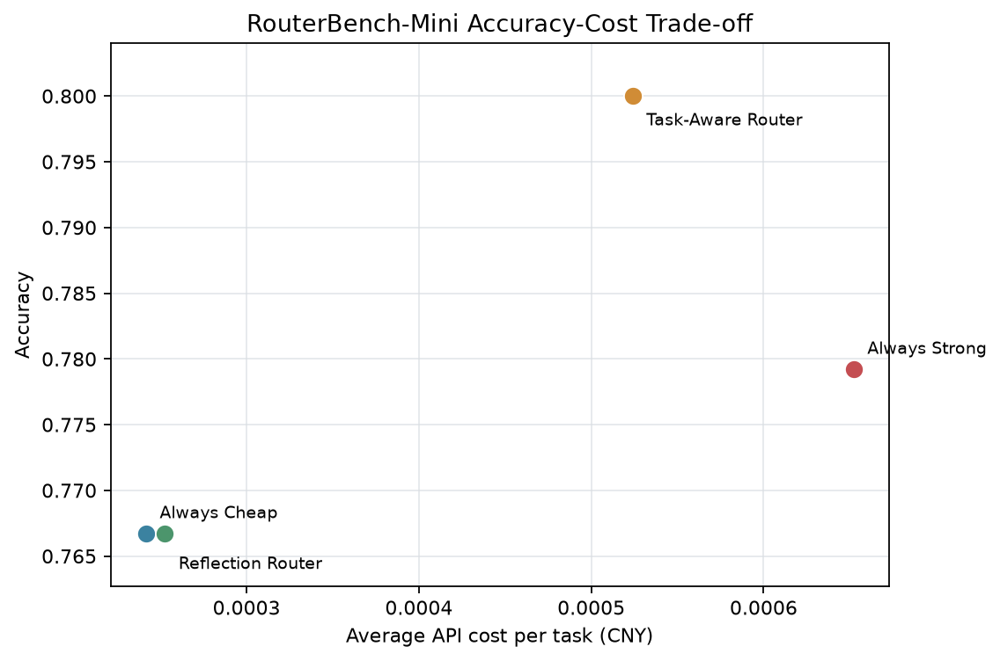

# RouterBench-Mini: Cost-Aware Model Reuse for Multimodal Agents

[中文说明](README.zh-CN.md)

RouterBench-Mini is a compact study of when a multimodal agent should reuse a cheaper model and when it should invoke a stronger model. It evaluates two models from the same Qwen 3.5 family on 300 text, vision, and tool-use tasks under a shared prompt, decoding configuration, and scoring pipeline.

## V2 Main Result



On the held-out 240-task test set, the observable-feature Task-Aware Router reached **80.00% accuracy**, 2.08 percentage points above Always Strong, while reducing average API cost by **19.7%** and latency by **9.7%**. It used the strong model on 68.33% of tasks without reading dataset identity or labels.

| Method | Accuracy | Avg. cost/task (CNY) | Avg. latency | Strong use |
|---|---:|---:|---:|---:|
| Always Cheap | 76.67% | 0.00024165 | 1,141 ms | 0.00% |
| Always Strong | 77.92% | 0.00065225 | 1,783 ms | 100.00% |
| **Task-Aware Router** | **80.00%** | 0.00052408 | 1,610 ms | 68.33% |
| Full Calibrated Reflection | 76.67% | 0.00025260 | 1,174 ms | 2.08% |

The strongest Reflection ablation was a simpler response-only calibrated gate: **79.17% accuracy** at CNY 0.00056005 per task, 14.1% cheaper than Always Strong but slower because review calls are sequential.

### Review-and-Correct Finding

When Reflection escalates, Strong receives the original task, image/tools, and Cheap candidate. It must independently verify the candidate, preserve it when correct, and change it only when necessary.

For the 143 escalations made by the response-only calibrated ablation:

| Finalization policy | Beneficial escalations | Harmful escalations |
|---|---:|---:|
| Blindly replace with independent Strong answer | 14 | 8 |
| Strong review-and-correct | 11 | **5** |

Review-and-correct reduced harmful escalation by **37.5%**, although it also missed three corrections. The mechanism helped, but did not eliminate reviewer error. Full task-feature calibration overfit the 60-example validation set; this negative result is retained rather than tuned on test data.

Full artifacts are in [`results/qwen3.5-v2-study`](results/qwen3.5-v2-study) and [`results/qwen3.5-v2-ablation`](results/qwen3.5-v2-ablation).

## Experimental Design

### Tasks

The deterministic builder creates 300 tasks and uses a category-stratified 20% validation / 80% test split.

| Category | Count | Sources | Scoring |
|---|---:|---|---|
| Text reasoning | 100 | 40 GSM8K, 30 CommonsenseQA, 30 BBH logical deduction | numeric or multiple-choice accuracy |
| Vision-language | 100 | 40 ScienceQA, 20 ChartQA, 20 OCR-VQA, 20 MMMU subjects | multiple-choice, exact match, or numeric tolerance |
| Agentic tool use | 100 | 50 BFCL V4 simple, 50 BFCL V4 multiple | function name and required arguments |

Sources: [GSM8K](https://huggingface.co/datasets/openai/gsm8k), [CommonsenseQA](https://huggingface.co/datasets/tau/commonsense_qa), [BIG-Bench Hard](https://github.com/suzgunmirac/BIG-Bench-Hard), [ScienceQA](https://huggingface.co/datasets/derek-thomas/ScienceQA), [ChartQA](https://huggingface.co/datasets/docintel/ChartQA), [OCR-VQA](https://huggingface.co/datasets/pppop7/OCR-VQA), [MMMU](https://huggingface.co/datasets/MMMU/MMMU), and [BFCL](https://github.com/ShishirPatil/gorilla/tree/main/berkeley-function-call-leaderboard).

### Model Pool

Both models support text, images, and tools, so the experiment studies capacity and routing rather than an artificial text-model/VLM boundary.

| Role | Model | Temperature | Max output | Thinking |
|---|---|---:|---:|---|
| Cheap | `qwen3.5-35b-a3b` | 0.2 | 256 tokens | disabled |
| Strong | `qwen3.5-397b-a17b` | 0.2 | 256 tokens | disabled |

### Routing Policies

1. **Always Cheap** sends every task to Cheap.
2. **Always Strong** sends every task to Strong.
3. **Task-Aware Router** computes a transparent risk score from inference-time features: question length, numbers, math/logic cues, image/chart/OCR cues, choices, tool count, required arguments, and schema depth. It never reads dataset, source, `rule_tier`, or ground truth. The risk threshold is selected on validation only.
4. **Reflection Router** calls Cheap first, estimates `P(Cheap answer is correct)` with cross-validated Platt calibration, and checks format and self-check signals. When escalation is triggered, Strong performs review-and-correct rather than blind replacement.

Threshold selection maximizes validation accuracy and breaks ties by API cost and strong-model usage. Test labels are never used to select thresholds.

## Reproduce

Python 3.10 or later is required.

```bash
python -m venv .venv
source .venv/bin/activate
pip install -e ".[study,test]"
python scripts/build_manifest.py
python -m pytest
```

For a no-key smoke test:

```bash
python -m routerbench_mini.cli \
  --manifest data/mini_manifest.jsonl \
  --models configs/models.mock.yaml \
  --out results/mock
```

For the real Qwen V2 study:

```bash
export QWEN_API_KEY="your-api-key"
export QWEN_BASE_URL="https://dashscope.aliyuncs.com/compatible-mode/v1"
python scripts/probe_models.py
python scripts/run_study.py --workers 8
python scripts/run_ablations.py --workers 8
```

Never commit an API key. Model names, token prices, and decoding settings are defined in [`configs/models.qwen_api.yaml`](configs/models.qwen_api.yaml). Responses are cached under `.cache/routerbench/` by task, model, prompt version, mode, candidate answer, and decoding settings.

## Repository Layout

```text
configs/                    Model and cost configurations
data/                       300-task manifest and validation/test splits
docs/                       Protocol and ablation notes
results/qwen3.5-v2-study/   Main V2 tables, plot, and error analysis
results/qwen3.5-v2-ablation/ Reflection ablations and counterfactual review table
scripts/build_manifest.py   Deterministic public-dataset builder
scripts/run_study.py        End-to-end main experiment
scripts/run_ablations.py    Reflection component ablations
src/routerbench_mini/       Providers, features, calibration, routers, scoring
tests/                      Unit tests
```

## Limitations

- This is a 300-example portfolio study using one provider and model family.
- The 60-example validation set is small; the full feature calibrator did not generalize.
- Review-and-correct reduced but did not eliminate harmful answer changes.
- Sequential review can be slower than a single Always Strong call.
- BFCL scoring checks the first canonical function call and required arguments.
- One OCR-VQA item rejected by both API endpoints before generation is deterministically replaced by the next sample; it is never scored or selected based on correctness.
- API latency varies with service load, and configured token prices can become stale.

The complete V2 interpretation is in [`docs/research_note.md`](docs/research_note.md). Archived V1 artifacts remain under `results/qwen3.5-study/` and are not directly comparable because the dataset mix and temperature changed.
