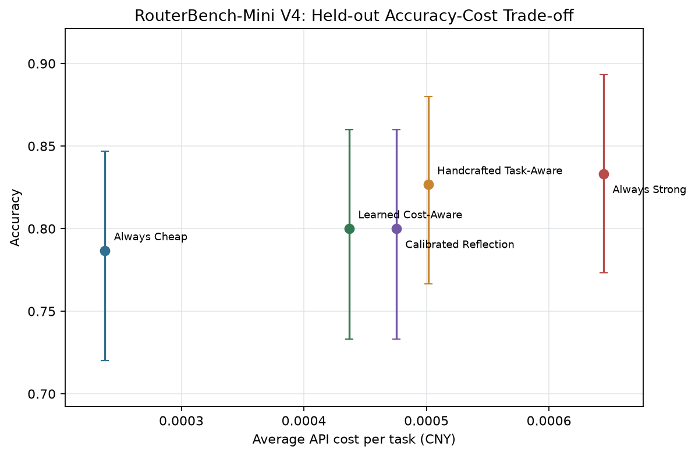

# RouterBench-Mini: Cost-Aware Model Reuse for Multimodal Agents

[中文说明](README.zh-CN.md)

This is a deliberately small personal research report, not a paper-level algorithmic contribution. It records a few days of work moving from an engineering prototype toward a more disciplined experimental process.

RouterBench-Mini studies when a multimodal agent should reuse a cheaper model and when it should invoke a stronger one. Two models from the same Qwen 3.5 family solve text, vision, and tool-use tasks under one prompt, decoding, scoring, and measured-cost pipeline. It does not propose a new foundation algorithm: TF-IDF, Ridge, logistic regression, probability calibration, and cross-validation are all classical methods. The value of this demo is in turning model routing into a reproducible small benchmark and documenting design mistakes, negative results, and corrections honestly.

## From V1 to V4

V1 through V4 are not four increasingly complex models. V1 and V2 develop the method, V3 explores feature choices, and V4 is a confirmatory evaluation after V3 method selection. The routing policy and the credibility of the protocol evolve together.

| Stage | Data protocol | Main change | Failure or conclusion |
|---|---|---|---|
| V1 prototype | 300 tasks; 60 validation/240 test | dataset-label rules; raw-confidence Reflection | label leakage; incomparable confidence scales; Reflection below Cheap |
| V2 correction | rebuilt 300 tasks; 60 validation/240 test | observable features, risk threshold, Platt calibration, review-and-correct | calibrator and threshold overfit the same 60 tasks |
| V3 exploration | old 300 development; new held-out set A of 150 | quality-gap labels, TF-IDF/Ridge, five-fold OOF, feature ablation | text-only matches Strong on A, but only as a candidate result |
| V4 confirmation | old 300 plus A for development; new held-out set B of 150 | freeze the text-only training recipe and confirm on new data | cost gain remains; matching Strong does not replicate |

### V1: make the real experiment run

V1 uses `qwen3.5-35b-a3b` and `qwen3.5-397b-a17b` with `temperature=0` and a 256-token output limit. Task-Aware reads a preassigned dataset `rule_tier`: GSM8K and logical deduction always use Strong, while CommonsenseQA always uses Cheap. This runs end to end but leaks dataset identity into routing and says little about unseen requests.

Reflection calls Cheap first, then checks format, prompted confidence, and self-check before optionally calling Strong. Validation selects threshold 0.8, but parseable tool calls receive a hard-coded confidence of 0.75, so every test tool task escalates; some incorrect math answers report 0.95 or 1.0 and are accepted. Test accuracy is 80.00% for Always Cheap, 81.67% for Always Strong, 81.25% for Task-Aware, and 78.75% for Reflection. V1 proves that the pipeline works and that raw confidence is not a common routing scale.

### V2: remove dataset labels and calibrate response trust

V2 changes temperature to 0.2 and rebalances vision data to 40 ScienceQA, 20 ChartQA, 20 OCR-VQA, and 20 MMMU tasks. Task-Aware no longer reads dataset names; it computes an observable risk score from question length, numbers, math/logic cues, images, choices, and tool-schema complexity, with a validation-selected threshold of 2.0.

Reflection trains logistic regression on Cheap confidence, format, self-check, and 13 request features, then uses Platt scaling to estimate `P(Cheap answer is correct)`. Strong performs review-and-correct after escalation. Task-Aware reaches 80.00% versus Strong's 77.92%, but Reflection reaches 95.00% on validation and only 76.67% on test. The same 60 validation tasks fit the calibrator and select its threshold; Cheap makes only five errors there, so the full model overfits. A response-only ablation reaches 79.17%, motivating a smaller calibrator and stricter out-of-sample threshold selection later.

### V3: learn the model quality gap and ablate features

V3 converts the old 300 tasks into development data and creates a fingerprint-disjoint held-out set A of 150. Both models answer every development task, and deterministic scoring produces `y = Strong correct - Cheap correct`. TF-IDF question features and 13 observable structured features feed Ridge to predict the quality gap; five-fold out-of-fold scores select one global escalation threshold without tuning on each example's fitted score.

The Learned Router ablation compares three inputs: Combined reaches 78.67% with 36.00% Strong use; Structured-only reaches 78.67% with 46.67% Strong use; Text-only reaches 79.33% with 54.67% Strong use. Text-only matches Always Strong on set A at 32.7% lower cost and is selected by the accuracy-first rule for confirmation. The difference is one task, so it is a candidate rather than a stable conclusion.

V3 also makes Reflection response-only and selects its threshold from outer-fold probabilities. It escalates 99/150 tasks but reaches only 74.00% accuracy: review fixes five Cheap errors and damages seven correct Cheap answers. Format, prompted confidence, and self-check remain too weak to verify semantic correctness.

### V4: confirm V3 rather than invent another router

V4 is not a new routing architecture. After method selection, held-out set A joins the old 300 tasks to form 450 development examples; a different fingerprint-disjoint set B of 150 becomes the final untouched confirmation set. The Learned Router freezes the V3-selected text-only recipe, then refits TF-IDF, Ridge, and its OOF threshold on 450 tasks. Reflection is likewise recalibrated on 450 tasks.

Learned Text-only reaches 80.00% on V4 versus Strong's 83.33%. It still reduces cost by 32.2%, but the V3 accuracy match does not replicate. Because V3 and V4 use different test tasks, the apparent move from 79.33% to 80.00% cannot be attributed to increasing development data from 300 to 450; Always Strong itself moves from 79.33% to 83.33%. V4 asks whether the V3-selected policy generalizes: its cost benefit does, while its accuracy result does not fully do so.

## Confirmatory Result



V4 is the final confirmatory set: 450 earlier examples are used for router development, while its 150 examples are fingerprint-disjoint and untouched until evaluation.

| Method | Accuracy | 95% bootstrap CI | Avg. cost/task (CNY) | Avg. latency | Strong use |
|---|---:|---:|---:|---:|---:|
| Always Cheap | 78.67% | [72.00, 84.68] | 0.00023762 | 1,178 ms | 0.00% |
| Always Strong | **83.33%** | [77.33, 89.33] | 0.00064448 | 2,619 ms | 100.00% |
| **Handcrafted Task-Aware** | **82.67%** | [76.67, 88.00] | 0.00050139 | **1,767 ms** | 66.00% |
| Learned Cost-Aware | 80.00% | [73.33, 86.00] | **0.00043693** | 2,391 ms | 50.00% |
| Calibrated Reflection | 80.00% | [73.33, 86.00] | 0.00047537 | 2,202 ms | 46.00% |

The frozen Task-Aware baseline is the most robust trade-off. It is 0.67 percentage points below Always Strong on V4, with a paired 95% difference interval of [-2.67, +1.33] points, while reducing cost by **22.2%** and observed latency by **32.5%**.

## Two Non-Overlapping Held-Out Batches

Held-out set A in V3 and set B in V4 each contain 150 non-overlapping tasks with 50 text, 50 vision, and 50 tool-use examples. Set A is later used to select text-only and joins V4 development, so it is no longer the final untouched confirmation set; only set B serves that role. Always Cheap, Always Strong, and Task-Aware remain unchanged across both batches, so the pooled table is only a cross-batch stability check for these frozen policies:

| Frozen method | Accuracy over 300 tasks across both batches | Avg. cost | Avg. latency | Strong use |
|---|---:|---:|---:|---:|
| Always Cheap | 77.00% | 0.00024081 | 935 ms | 0.00% |
| Always Strong | 81.33% | 0.00065324 | 2,094 ms | 100.00% |
| **Handcrafted Task-Aware** | **80.67%** | **0.00050602** | **1,536 ms** | **65.67%** |

Task-Aware is again 0.67 points below Always Strong; the paired interval is [-2.33, +1.00] points. Its cost is **22.5% lower** and latency **26.6% lower**. This replaces the earlier V2 claim based on one 240-task split with a more conservative replicated conclusion.

## Final Methods and Interpretation

### Learned routing

The new `LearnedQualityGapEstimator` predicts `Strong accuracy - Cheap accuracy` before generation. It uses TF-IDF question features and/or observable structured features, Ridge regularization, and five-fold out-of-fold predictions for threshold selection. Dataset names and test labels are unavailable to the router.

The result is informative but mixed:

- V3 combined router: 78.67% accuracy, 43.2% lower cost than Always Strong, 36% Strong use.
- V3 text-only ablation: 79.33%, exactly matching Always Strong at 32.7% lower cost.
- V4 confirmation of the selected text-only variant: 80.00% versus Strong's 83.33%, at 32.2% lower cost.

The V3 gain did not fully replicate. Only 52 of 450 development examples distinguish the two models, so the learned target remains sparse. The repository retains this negative result instead of selecting a new policy on V4.

### Reflection and review

Reflection fits a response-only correctness calibrator on development responses and selects its threshold from outer-fold predictions. Strong receives the original task, image/tools, and Cheap candidate, preserving the candidate if correct and changing it only when necessary.

This mechanism is not reliably superior to blind Strong replacement. On V4, review and blind Strong have the same 7 beneficial and 5 harmful escalations. On V3, review produces fewer beneficial and one more harmful escalation. Prompted self-reported confidence also shifts across replications, making it a weak routing signal. Reflection is therefore an agentic diagnostic, not the headline method.

## Final Reflection

This project does not package classical machine learning as a new routing theory. The Learned Router is Ridge over TF-IDF and structured features; Reflection is a logistic-regression probability gate in a two-stage cascade; thresholds are selected empirically by cross-validation. Their algorithmic novelty is limited. The useful part of the exercise is the research process: define reproducible tasks, establish strong and cheap controls, identify leakage and overfitting, run ablations, retain negative results, and challenge an attractive result on a new confirmation set.

The simplest Handcrafted Task-Aware policy is ultimately the most stable. Learned routing is constrained by sparse pairwise model disagreements, while Reflection suffers from shifted prompted confidence and regressions during Strong review. This demo is best read as a small report on moving from development-oriented implementation toward research-oriented evaluation, not as a paper-level contribution.

## Next Experiments

1. **Collect routing-informative data.** Only 52 of 450 development examples distinguish Cheap from Strong. Future sampling should target harder tasks and model disagreements, and report learning curves instead of mainly adding `y=0` examples.
2. **Run a controlled data-scaling study.** Train the same router on 300 versus 450 examples and evaluate both on one new frozen test set, keeping features, threshold selection, and model calls identical.
3. **Improve request representations.** Compare a fixed pretrained text embedding against TF-IDF on the same split, then add a lightweight multimodal or image embedding so pre-generation routing can inspect visual content rather than only `has_image`.
4. **Optimize an explicit utility.** The current policy maximizes accuracy and uses cost only to break ties. A follow-up should optimize `accuracy - lambda * cost - mu * latency`, or minimize cost under a prespecified accuracy-loss constraint, with the constraint fixed before evaluation.
5. **Strengthen uncertainty and verification.** Where available, compare token log-probability, entropy, sampling consistency, or an independent verifier against prompted confidence. Keep blind Strong replacement as the counterfactual for review-and-correct.
6. **Broaden replication.** Add more model tiers, model families, and sampled batches; report paired uncertainty and failures; freeze all policies and hyperparameters before constructing another final confirmation set.

## Experimental Design

### Tasks

Each 300-example block has the same composition:

| Category | Count | Sources | Scoring |
|---|---:|---|---|
| Text reasoning | 100 | 40 GSM8K, 30 CommonsenseQA, 30 BBH logical deduction | numeric or multiple-choice accuracy |
| Vision-language | 100 | 40 ScienceQA, 20 ChartQA, 20 OCR-VQA, 20 MMMU subjects | multiple-choice, exact match, or numeric tolerance |
| Agentic tool use | 100 | 50 BFCL V4 simple, 50 BFCL V4 multiple | function name and required arguments |

Sets A and B use half-sized blocks with identical proportions. Query, choice, tool-schema, and image-content fingerprints enforce zero overlap among the original 300-task block, set A, and set B.

### Model pool

| Role | Model | Temperature | Max output | Thinking |
|---|---|---:|---:|---|
| Cheap | `qwen3.5-35b-a3b` | 0.2 | 256 tokens | disabled |
| Strong | `qwen3.5-397b-a17b` | 0.2 | 256 tokens | disabled |

Both models support text, images, and tools. The experiment studies capacity selection, not an artificial text-model/VLM boundary.

### Policies

1. **Always Cheap** is the low-cost fixed-model control.
2. **Always Strong** is the high-capacity fixed-model control.
3. **Handcrafted Task-Aware** uses transparent request-time cues and a frozen risk threshold of 2.
4. **Learned Cost-Aware** learns the model-pair quality gap from development responses.
5. **Calibrated Reflection** calls Cheap first and conditionally asks Strong to review-and-correct.

The handcrafted feature constants are heuristic, not literature-derived. The learned router is the principled alternative; the rule baseline remains useful because it generalizes more stably in this small-data regime.

## Literature Positioning

The project follows quality-gap and preference-based routing in [Hybrid LLM](https://arxiv.org/abs/2404.14618), [RouteLLM](https://arxiv.org/abs/2406.18665), and [LLM Routing with Benchmark Datasets](https://arxiv.org/abs/2309.15789); it treats post-response escalation as a cascade following [FrugalGPT](https://arxiv.org/abs/2305.05176) and [AutoMix](https://arxiv.org/abs/2310.12963). [Deep Model Reassembly](https://arxiv.org/abs/2210.17409) motivates model reuse under performance and resource constraints, but does not justify the handcrafted query thresholds.

See [`docs/literature_review.md`](docs/literature_review.md) and [`docs/supervisor_review.zh-CN.md`](docs/supervisor_review.zh-CN.md) for the detailed critique and method changes.

## Reproduce

```bash
python -m venv .venv
source .venv/bin/activate
pip install -e ".[study,test]"
python scripts/build_manifest.py
python scripts/build_v3_data.py
python -m pytest
```

Set `QWEN_API_KEY` and `QWEN_BASE_URL`, then run:

```bash
python scripts/run_v3_study.py --study-version V3 --workers 8
python scripts/run_v3_ablations.py --workers 8
python scripts/build_v3_data.py \
  --development data/manifest.jsonl data/v3_test.jsonl \
  --out data/v4_test.jsonl --image-dir data/v4_images \
  --seed 20260713 --version v4
python scripts/run_v3_study.py \
  --development data/manifest.jsonl data/v3_test.jsonl \
  --test data/v4_test.jsonl --out results/qwen3.5-v4-study \
  --learned-features text --study-version V4 --workers 8
python scripts/aggregate_replications.py
```

Never commit API keys. Responses are cached under `.cache/routerbench/`; cache identity includes task content, model, prompt version, solve/review mode, candidate answer, and decoding settings.

## Limitations

- The study uses one provider, one model family, and 600 total sampled tasks.
- The model pair disagrees on few development examples, limiting learned-router sample efficiency.
- TF-IDF captures textual similarity but not image content; a learned multimodal encoder is future work.
- Prompted confidence is not a reliable substitute for token-level or internal uncertainty.
- API latency includes remote queueing variance; cost conclusions are more stable than latency conclusions.
- BFCL evaluation checks the first canonical function call and required arguments.
- Public dataset revisions are not pinned, so rebuilding in the future may require version updates.

Main artifacts are under [`results/qwen3.5-v4-study`](results/qwen3.5-v4-study), replicated frozen-policy results under [`results/qwen3.5-confirmatory`](results/qwen3.5-confirmatory), and V3 learned-feature ablations under [`results/qwen3.5-v3-ablation`](results/qwen3.5-v3-ablation).
