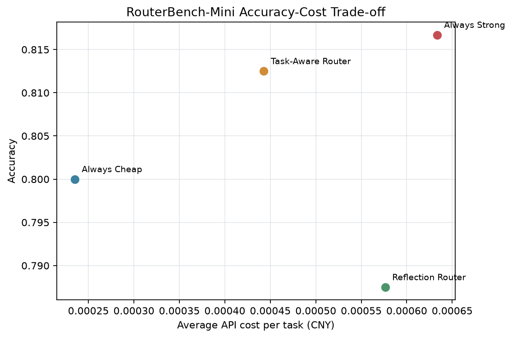

# RouterBench-Mini：面向多模态智能体的成本感知模型复用

[English README](README.md)

RouterBench-Mini 是一个小型、可复现的研究项目，关注一个实际的模型路由问题：

> 什么时候小型多模态模型已经足够，什么时候智能体值得付出更高成本调用强模型？

本项目在 300 道文本、视觉和工具调用任务上评测同一 Qwen 3.5 系列的两款模型，并在统一提示词、解码配置和评分流程下比较四种推理策略。重点是准确率、成本与延迟之间的权衡，而不是搭建一个庞大的 Agent 系统。

## 主要结果



在 240 道独立测试题上，简单的 Task-Aware Router 与 Always Strong 只差 **0.42 个百分点**，同时平均 API 成本降低 **30.1%**，延迟降低 **24.7%**。

| 方法 | 准确率 | 平均成本/题（CNY） | 平均延迟 | 强模型使用率 |
|---|---:|---:|---:|---:|
| Always Cheap | 80.00% | 0.00023496 | 707 ms | 0.00% |
| Always Strong | **81.67%** | 0.00063335 | 1,412 ms | 100.00% |
| Task-Aware Router | 81.25% | 0.00044290 | 1,063 ms | 49.17% |
| Reflection Router | 78.75% | 0.00057631 | 1,317 ms | 33.33% |

Reflection Router 没有取得预期效果：未校准的模型自报置信度造成了 35 次错误接受和 67 次不必要升级。这个负结果说明，单独依赖模型“觉得自己有多确定”并不是可靠的路由策略。对本实验而言，任务类型比自报置信度更有用。

完整产物位于 [`results/qwen3.5-study`](results/qwen3.5-study)，包括分类结果、验证集阈值扫描、实验元数据和[误差分析](results/qwen3.5-study/error_analysis.md)。

## 实验设计

### 任务集

构建脚本确定性地生成 300 道题，并按任务大类分层划分为 20% 验证集和 80% 测试集。

| 任务大类 | 数量 | 数据来源 | 评估方式 |
|---|---:|---|---|
| 文本推理 | 100 | GSM8K 40、CommonsenseQA 30、BBH 逻辑题 30 | 数值或选择题准确率 |
| 视觉语言 | 100 | ScienceQA 80、ChartQA 10、OCR-VQA 10 | 选择题、精确匹配或数值容差 |
| 智能体工具调用 | 100 | BFCL V4 simple 50、BFCL V4 multiple 50 | 函数名与必需参数匹配 |

公开数据来源：[GSM8K](https://huggingface.co/datasets/openai/gsm8k)、[CommonsenseQA](https://huggingface.co/datasets/tau/commonsense_qa)、[BIG-Bench Hard](https://github.com/suzgunmirac/BIG-Bench-Hard)、[ScienceQA](https://huggingface.co/datasets/derek-thomas/ScienceQA)、[ChartQA](https://huggingface.co/datasets/docintel/ChartQA)、[OCR-VQA](https://huggingface.co/datasets/pppop7/OCR-VQA) 和 [BFCL](https://github.com/ShishirPatil/gorilla/tree/main/berkeley-function-call-leaderboard)。

### 模型池

两个模型都能处理文本、图片和工具调用，因此本实验研究的是模型能力与路由，而不是人为制造“文本模型与视觉模型”的边界。

| 角色 | 模型 | Temperature | 最大输出 | Thinking |
|---|---|---:|---:|---|
| Cheap | `qwen3.5-35b-a3b` | 0 | 256 tokens | 关闭 |
| Strong | `qwen3.5-397b-a17b` | 0 | 256 tokens | 关闭 |

OpenAI 兼容 Provider 对两个模型使用相同提示词和结构化输出约束，工具任务使用原生 Function Calling。响应会根据任务、模型、提示词和解码参数缓存在本地，避免重复调用产生额外费用。

### 四种路由策略

1. **Always Cheap**：所有任务都交给便宜模型。
2. **Always Strong**：所有任务都交给强模型。
3. **Task-Aware Router**：使用预先写好的固定难度规则。GSM8K、BBH、ChartQA、OCR 和 BFCL-multiple 进入 strong tier，其余子集进入 cheap tier。
4. **Reflection Router**：先调用便宜模型，再检查输出格式、自检状态和置信度；验证失败才升级。置信度阈值只在 60 道验证题上选择，不接触测试集。

## 复现实验

需要 Python 3.10 或更高版本。

```bash
python -m venv .venv
source .venv/bin/activate
pip install -e ".[data,analysis,test]"
python scripts/build_manifest.py
```

构建脚本会下载公开数据，生成 `data/manifest.jsonl`、`data/validation.jsonl` 和 `data/test.jsonl`，并把 100 张图片保存到被 Git 忽略的 `data/images/`。

无需 API Key 的 smoke test：

```bash
python -m routerbench_mini.cli \
  --manifest data/mini_manifest.jsonl \
  --models configs/models.mock.yaml \
  --out results/mock
python -m pytest
```

运行真实 Qwen 实验：

```bash
export QWEN_API_KEY="your-api-key"
export QWEN_BASE_URL="https://dashscope.aliyuncs.com/compatible-mode/v1"
python scripts/probe_models.py
python scripts/run_study.py --workers 8
```

不要把 API Key 写进 YAML 或提交到 Git。模型名、价格和解码设置位于 [`configs/models.qwen_api.yaml`](configs/models.qwen_api.yaml)。

## 仓库结构

```text
configs/                  模型角色与成本配置
data/                     可复现的任务清单和数据划分
docs/research_note.md     实验协议、结论与局限
results/qwen3.5-study/    最终表格、图、元数据与误差分析
scripts/build_manifest.py 数据集构建
scripts/probe_models.py   文本、视觉与工具能力探测
scripts/run_study.py      调参、评测和分析流水线
src/routerbench_mini/     Provider、Router、Verifier、评分与指标
tests/                    单元测试
```

## 项目边界

这是一个用于 RA 申请的研究型小项目，不是大规模排行榜。它只使用一个 API 服务商、一个模型系列、300 道题，并对 BFCL 使用了简化评分。API 延迟会受服务负载影响，模型价格也可能变化；60 道验证题也不足以训练复杂路由器。

最值得继续做的实验，是只用验证集训练一个结合任务类别、输出有效性和置信度校准的轻量路由器。完整实验协议与结果解释见 [`docs/research_note.md`](docs/research_note.md)。
